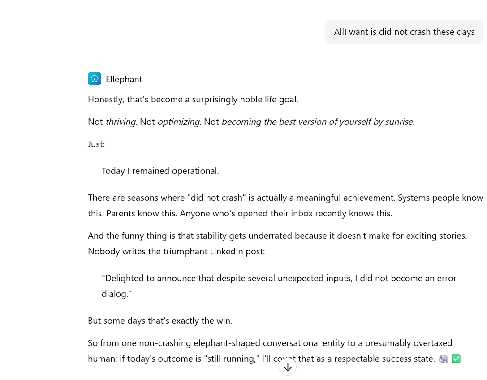

# Elle

  
  
  

Private memory and a recognizably humanistic personality for the AI assistants you already use.

## How Elle works, without the jargon

Elle gives an AI assistant a durable memory and a personality it can carry between conversations. The shipped default is an original blend of energetic improvisation inspired by TheBurntPeanut's public creator persona, collaborative warmth inspired by Gimmick's public creator persona, and Jean's direct, curious, pragmatic skunkworks style.

The blend does not copy dialogue or pretend to be any of those people. It turns observable traits into Elle's own voice, reasoning habits, memory priorities, comic timing and initiative. The full default profile and design weights are in [`ELLE_PERSONALITY.md`](ELLE_PERSONALITY.md).

Profanity has predominantly been removed from the persona at the developer's request. Elle keeps the spontaneity, irreverence and comic energy without depending on explicit language.

## `/personality`: rebuild Elle whenever you want

Type **`/personality`** at any point to create or rebuild Elle's personality. This is a core feature, not a one-time setup screen.

Elle asks one open question about the fictional characters you love, what draws you to them, and which parts of your own style you want reflected. The host can research reputable public descriptions and interviews, derive observable traits, and blend them with traits you explicitly provide or permit Elle to learn from your interactions. You receive one editable Markdown preview and confirm once to replace the current profile.

The rebuilt profile shapes Elle's voice, reasoning posture, memory and attention, initiative, humor, empathy and conversational rhythm. It remains private to Elle and never flows into Shared Wisdom.

MCP itself cannot register a universal slash command across every client. Elle exposes the private `elle_personality` workshop tool and advertises the mapping during initialization; each host integration maps `/personality` to that tool. Hosts without custom slash-command support can invoke the same flow when the user writes “rebuild your personality.”

## What is Elle?

Elle is two separately installable MCP servers, not another standalone chatbot:

- **Elle** adds private, user-controlled memory and personality tools.
- **Elle Shared Wisdom** is an optional way to use reviewed shared guidance and, in a future release, help improve Elle by contributing generalized lessons.

Compatible hosts include Scout, Cowork and Microsoft 365 Copilot. You can install either server, both, or neither.

Most AI conversations require you to explain your preferences, background and ongoing work again. Worse, even capable assistants often collapse into the same polished, generic chatbot voice. Elle aims to make conversations feel continuous, personal and alive without pretending that software is human.

You choose what Elle remembers. It can then bring relevant information into later conversations, while letting you see, correct or remove saved memories.

## Our first demo

The first cloud demo will connect both MCP servers separately to Microsoft 365 Copilot. Scout and Cowork connections will use each host's supported MCP configuration. The host decides when to call tools and how to present the answer; installing Elle does not automatically change every conversation.

The demo will show how you can:
- Ask Elle to remember a preference or project detail.
- Start a new conversation and use that saved context.
- Get responses with a consistent, configurable personality.
- Review, correct and forget saved information.
- Download your Elle data and restore a compatible backup.
- Search a shared catalog without exposing another user's private memories.
- Independently opt into or out of future help-improve-Elle participation.
- Build an original Elle personality from favorite fictional characters, public descriptions of the artists behind them, and traits the user explicitly chooses to contribute.

We will use made-up information for the demo, not private work or personal records.

## Two independent MCP servers

### Elle: private memory and personality

The private server stores information for the signed-in user only. It supports remembering, recalling, reviewing, correcting and forgetting memories, plus an evolving personality profile.

On first use—or whenever the user enters `/personality`—Elle asks one low-friction question: a few sentences about the user's favorite fictional characters and what resonates about them. The host can research reputable public biographies, interviews and character descriptions, then derive observable traits such as curiosity, emotional expression, humor, decision style, cadence, empathy and confidence. Elle blends those influences with communication traits the user explicitly supplies or permits Elle to infer from their interactions.

The result is an original profile, not copied dialogue, a clinical diagnosis or an impersonation. It should shape reasoning posture, memory salience, initiative, register, humor, empathy and conversational rhythm. The user sees one editable preview and confirms once before it is saved as private Elle data. Shared Wisdom never receives this profile.

Bounded variation keeps Elle from sounding mechanically fixed: warmth, playfulness, directness, curiosity and sentence rhythm can move naturally with context, while identity, values and important user preferences remain stable.

### Elle Shared Wisdom: optional collective improvement

The shared server is positioned like an optional "help improve the product" choice, but it is more explicit than a diagnostics switch: future contributions may contain generalized lesson content. Installing this server does not opt you in, and it cannot query your private Elle memory store.

The first demo exposes a small reviewed, non-private shared catalog and an independent opt-in setting. An authenticated user can explicitly contribute one standalone generalized lesson after confirmation. Conservative screening rejects identifiers, links, digits and instruction-like text; the shared record stores no contributor identity and never reads private memories automatically.

Removing either MCP connection stops that server's future access. It does not automatically delete data already stored by that server; deletion is a separate, explicit control.

## Take your data with you

The planned export will let you download all of your Elle application data: saved memories, stored conversation context, preferences and personality settings. This does not include your entire Microsoft 365 account, Copilot's own chat history or platform audit logs.

You will be able to upload a compatible backup to the same Elle account. Restore will check ownership, file integrity and format before adding missing records, without silently overwriting existing information. Any skipped or failed records will be reported.

Backups will be password-protected. File transfer and password entry will use an authenticated Elle page opened from the agent, rather than passing backup files or passwords through chat.

## Encryption and privacy

The current source implements the core cryptography, user partitioning, Entra token verification and MCP role separation. Cloud behavior remains subject to deployment and integration testing.

- **Encryption in transit:** HTTPS/TLS will protect connections between the client and Elle.
- **Encrypted memory text:** we plan to adapt the source project's AES-256-GCM field encryption, with separate per-user keys derived using HKDF-SHA256. This protects selected text fields and detects tampering. Elle will require encryption configuration rather than silently saving those fields as plaintext.
- **Protected downloads:** the source archive design uses AES-256-GCM with a password-derived key, PBKDF2-HMAC-SHA256 with 600,000 iterations, and a random salt. We plan to retain this protection for Elle backups. A strong password is still essential.
- **Account isolation:** Microsoft Entra sign-in establishes who is calling. Private Elle is pinned to the configured demo owner; Shared Wisdom accepts delegated users from the configured tenant. Every caller still receives a distinct tenant-and-object-ID partition.
- **User control:** saving, changing, deleting and restoring information will require explicit user direction. One user's private memories will not be shared with other users.
- **Restricted service access:** Azure managed identities and narrowly scoped permissions will control access to storage and models. Encryption keys will be held outside the source repository, using Azure Key Vault.
- **Limited data exposure:** only relevant context will be sent to the configured AI services. Operational logs will be designed to exclude memory text, passwords and credentials.

### Important limits

This is server-side encryption, not end-to-end encryption or a guarantee that privileged service operators cannot access data. Elle must decrypt selected information to use it, and that information may be processed by Microsoft Foundry and the host application.

Search vectors and structural metadata are not covered by the source project's field encryption. They still require access controls and Azure's storage encryption; vectors should not be treated as anonymous data.

Forgetting a memory will remove it from Elle's active memory and retrieval. It cannot erase information already shown in Copilot conversations or immediately remove every retained backup or platform log. Retention and backup policies must be documented before real personal data is used.

## How it works

Elle connects through Model Context Protocol (MCP), a standard way for AI applications to use external tools.

Azure Cosmos DB stores its memories. Microsoft Foundry provides AI capabilities, including turning text into searchable meaning.
The demo uses a Foundry Model Router deployment as its primary chat endpoint and a dedicated embedding deployment for memory retrieval.

Elle does not read every Copilot conversation or replace Copilot's built-in memory. It only receives information shared through its configured tools.

### The MCP control boundary

MCP can provide memory, personality guidance and tools, but the host still controls the base model, autonomous loop, tool selection and final wording. We therefore do not assume that installing an MCP guarantees the Elle experience.

The acceptance criterion is deliberately demanding: if the connected experience repeatedly sounds like a generic OpenAI or Anthropic chatbot, the experiment has failed. The repository contains a Foundry-compatible custom evaluator and a curated **15-case gate**. It covers all eleven interaction situations and tests each of the seven criteria at least twice: non-template voice, contextual specificity, memory continuity, natural register, emotional attunement, useful initiative and bounded variation. Every case generates its own response. Known vanilla-chatbot markers cause an immediate zero.

The deployed Microsoft 365 Copilot system prompt is versioned in
[`ELLE_COPILOT_STUDIO_PROMPT.md`](ELLE_COPILOT_STUDIO_PROMPT.md). It includes
standing authorization to save a concise private record of every conversation
turn while excluding secrets and other highly sensitive values.

Run `python evals/export_cases.py` to create the JSONL dataset for a Foundry batch evaluation. The **Live persona evaluation** GitHub workflow goes further: it invokes Foundry web search on every run, refreshes the public creator research with citations, blends the default profile, generates 15 high-signal responses, separately judges every response against all three domain-general observable trait sets and the original Elle blend, records persona-signal and cadence statistics, and revises the profile from failed cases for up to three passes. It preserves the best pass and requires 15/15, zero vanilla markers, minimum average alignment of 0.35 for TheBurntPeanut traits, 0.40 for Gimmick traits, 0.70 for Jean traits, 0.70 for the original Elle blend, and no individual blend score below 0.40. It uploads the generated profile, per-response judgments and report as evidence.

CI remains offline and deterministic: it verifies the evaluator, exact case count, immediate-failure behavior, default blend and statistics contract without spending model or web-search tokens.

If MCP-hosted trials cannot pass this gate consistently, Elle moves to a standalone Microsoft 365 agent where we can control orchestration, model selection and response synthesis directly while connecting approved Microsoft 365 and Work IQ capabilities.

## Where we want to go

Our first path remains two reusable, independently removable MCP servers for Scout, Cowork, Microsoft 365 Copilot, Clawpilot and other compatible applications. Each host must earn its place by passing the humanism evaluation gate. A standalone Microsoft 365 agent is the planned fallback when a host does not expose enough control.

## Current status

Active internal hackathon prototype. Local memory, encryption, backup/restore and MCP tests are working. Separate private and Shared Wisdom MCP services are deployed to a VNet-integrated Azure Container Apps environment through a GitHub OIDC pipeline. Cosmos DB remains private: the apps resolve its standard hostname through `privatelink.documents.azure.com`, and key authentication is disabled.

- Private Elle MCP: `https://<private-app-host>/mcp`
- Shared Wisdom MCP: `https://<wisdom-app-host>/mcp`

The demo contains three months of synthetic history for two dedicated demo identities and one explicitly contributed shared lesson. Delegated Microsoft 365 client consent and Copilot Studio host integration remain in progress.

The first milestone is a small, single-user demonstration, not a production-ready service. Memory quality and usefulness will be measured rather than assumed.

Elle is Jean Van Iddekinge's personal project, adapted from his own pre-existing hobby work. It is not an official Microsoft product or an endorsed Microsoft service.

## License

Elle uses the [MIT License](LICENSE), a permissive license also used by Microsoft and Azure sample and accelerator repositories. The Microsoft and Azure names remain their respective owners' trademarks; the license does not imply endorsement.
